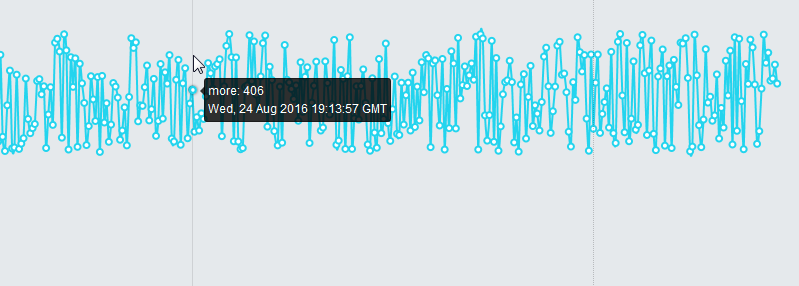
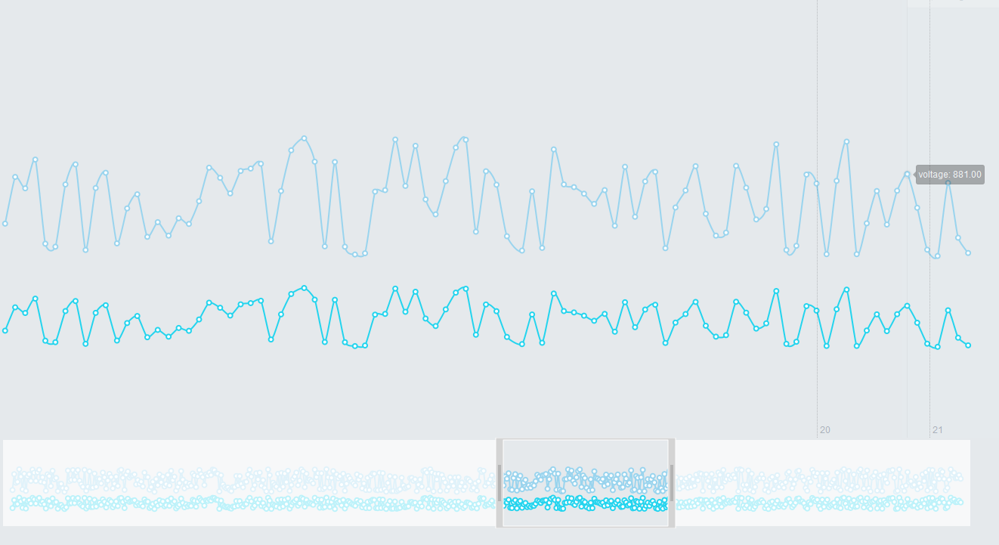
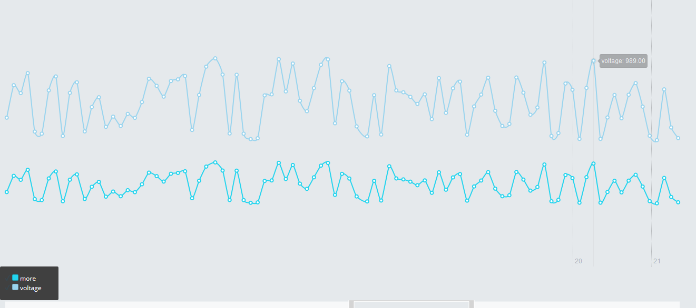
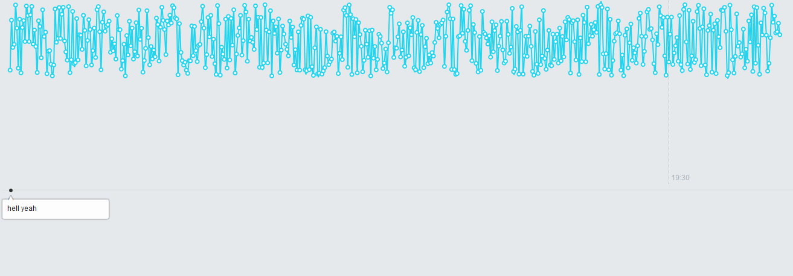

# Ember-rickshaw

Ember implementation for rickshaw
Timeseries graphs done right in Rickshaw

## Installation

* `npm install https://github.com/Ahamtech/ember-rickshaw.git#master`
* `bower install rickshaw`

##TODO
Better Documentation

Support for Multi Axis representation

Better start up code snipperts

Demo App

Adding into NPM repo

## Ember Hover

```handlebars
{{#ember-rickshaw type="lineplot" height="600" width="1300" data=model hover=true}}
```


## Ember Hover

```handlebars
{{#ember-rickshaw type="lineplot" height="600" width="1300" data=model hover=true}}
```

```handlebars
{{#ember-rickshaw type="lineplot" height="600" width="1300" data=model hover=true hover-option=options}}
```
```javascript
	options: {formatter: function(series, x, y) {
		var date = '<span class="date">' + new Date(x * 1000).toUTCString() + '</span>';
		var swatch = '<span class="detail_swatch" style="background-color: ' + series.color + '"></span>';
		var content = swatch + series.name + ": " + parseInt(y) + '<br>' + date;
		return content;
	}}
```


## Ember Slider

```handlebars
{{#ember-rickshaw type="lineplot" height="600" width="1300" data=model hover=true slider=true slider-element="ember-slider"}}
<div id="ember-slider"></div>
```


## Ember Axis Time

```handlebars
{{#ember-rickshaw type="lineplot" height="600" width="1300" data=model hover=true axistime=true }}
```

## Ember Legend

```handlebars
{{#ember-rickshaw type="lineplot" height="600" width="1300" data=model hover=true legend=true legend-element="legend" legend-highlight=true}}
<div class="column" id="legend"></div>
```


## Ember Annotator

```handlebars
{{#ember-rickshaw type="lineplot" height="600" width="1300" data=model hover=true axistime=true hover-option=hoverformatter annotator=true annotator-element="annotator" annotator-data=annatator}}

<div id="annotator"></div>
```


# License

Ember Rickshaw is Copyright © 2016 Ahamtech. It is free software, and may be redistributed under the terms specified in the [LICENSE](https://github.com/Ahamtech/ember-rickshaw/blob/master/LICENSE) file.

# About Ahamtech

> Ember-Rickshaw is maintained by Ahamtech.

We love open source software, Erlang, Elixir, and Phoenix. See our other [opensource projects](github.com/ahamtech), or hire our [Elixir Phoenix development team](ahamtech.in) to design, develop, and grow your product.
